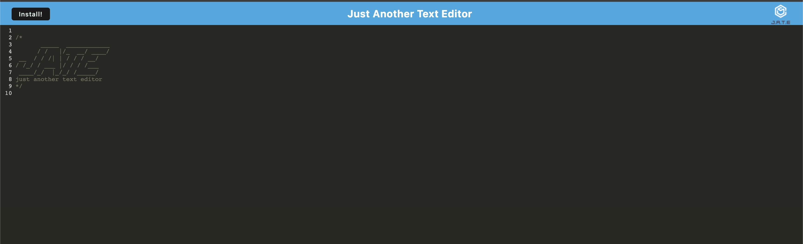

# TextEditor

## Description
This Progressive Web App (PWA), is intended to create notes or code snippets with or without an internet connection. You'll reliably be able to retrieve them for later use.

- https://github.com/tiannaj23/TextEditor

## Table of Contents
- [Title](#title)
- [Installation](#installation)
- [Usage](#usage)
- [Tests](#tests)
- [Contributing](#contributing)
- [Questions](#questions)
- [Mock-Up](#mock-up)

## Installation
- User should clone this repository from GitHub.
- Run npm `i` to install dependencies.
- Start the application by running npm start.
- Go to the url of the application `http://localhost:3000/`

## Usage
- Use the deployed URL to open the application.
- Type any code snippet or notes in the editor. The content will be saved in the IndexedDB when the window is unfocused. When you reopen the text editor after closing it, the content in the text editor will be retrieved from the IndexedDB.
- If the Install button is clicked, the web application will be downloaded as an icon in your desktop.
- The application runs while offline.

## License
None

## Tests
None.

## Contributing
To contribute to this application: Please email the author for guidelines.

## Questions
If you have any questions about the repo, open an issue or contact me directly at tiannaj23@gmail.com. You can find more of my work at [https://github.com/tiannaj23](https://github.com/https://github.com/tiannaj23/).

## Mock-Up

- https://sleepy-sea-65664.herokuapp.com/
- 